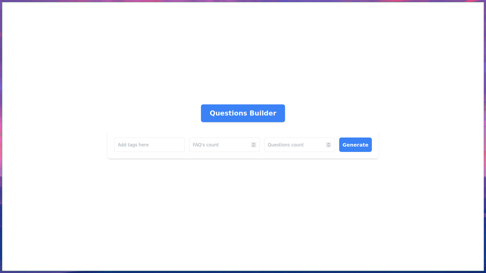
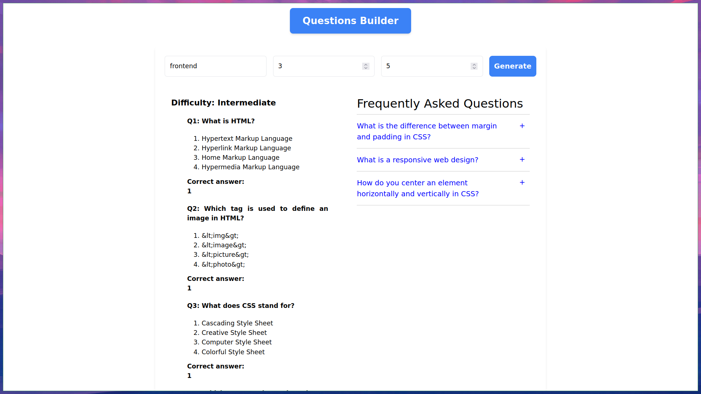
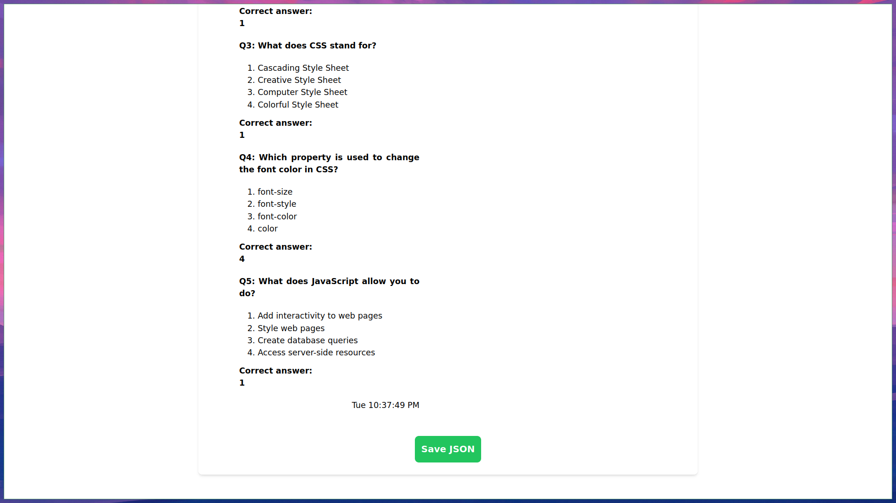

Objective: Generate questions given a list of topics (i.e., domain -> frontent, js, go, backend, design) and dificulty along with test cases, correct answers , faqs

TODO's:

UI: 
1. Search Bar: user can type the topics and relevant details ``[DONE]``
2. Output Field: Where the output is visible after optimisation and getting the data back from chatGPT ``[DONE]``
  a: Question:
     Answer
     FAQ's UI
3. Export the generated Output into JSON ``[DONE]``

Backend:
1. make ChatGPT act as per the need/topic with relevant details ``[DONE]``
2. provide questions, answers, faqs aligned with the topic and with details ``[DONE]``

Usage:
1. git clone this repo
2. cd  repo
3. set the VITE_OPENAI_API_KEY in .env file
4. npm install
5. npm run dev
6. nagivate to http://localhost:5173/

Contributors:
Saroj Kumar Mahato (sarojkumar@criodo.com)
Sarath Kumar (sarathkumar@criodo.com)

Preview:

Screenshots:

